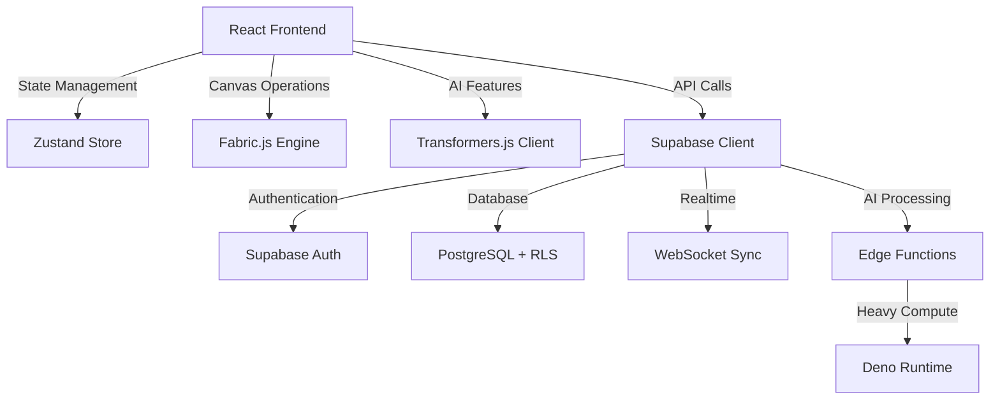

<div align="center">

# 🎨 Creative Intelligence Hub

### *AI-Integrated Design Platform for Brand-Consistent Creative Assets*

**Transform raw creative ideas into high-performance, brand-aligned designs using machine learning and a powerful dynamic canvas.**

[](https://opensource.org/licenses/MIT)
[](https://www.typescriptlang.org/)
[](https://reactjs.org/)
[](https://vitejs.dev/)
[](https://supabase.com/)

[Features](#-core-ai-features) • [Architecture](#-technical-architecture) • [Quick Start](#-quick-start) • [Usage](#-usage-guide) • [Contributing](#-contributing)

</div>

---

## 🌟 Overview

Creative Intelligence Hub is an advanced, AI-integrated design platform built for designers, marketers, and creative teams. By combining machine learning with professional design tools, it automates tedious workflows—like background removal, brand extraction, and multi-format resizing—while empowering users to focus on creativity and innovation.

**Ideal for:**
- 🎯 **Marketing Teams** creating multi-platform campaigns at scale
- 🚀 **Startups & Agencies** maintaining consistent brand identity across touchpoints
- 🎨 **Designers** exploring rapid prototyping, A/B testing, and creative experimentation
- 📱 **Social Media Managers** optimizing content for maximum engagement
- 🏢 **Enterprises** standardizing design workflows with AI-powered compliance

---

## ✨ Core AI Features

### 🧠 **Intelligence & Analysis**

<table>
<tr>
<td width="50%">

**👁️ Visual Auditor**
- Automatically scans designs for brand compliance
- Checks WCAG accessibility standards
- Analyzes visual balance and composition
- Provides actionable improvement suggestions

**🔥 Attention Heatmaps**
- Predicts where users will look first using AI
- Eye-tracking simulation based on computer vision
- Optimize layouts for maximum message impact
- Data-driven design validation

</td>
<td width="50%">

**🧬 Brand DNA Extractor**
- Deep-scan existing assets to identify brand identity
- Automatically extract colors, typography, and visual styles
- Build reusable brand kits from any input
- Maintain consistency across all creative work

**📈 Trend Forecast**
- Analyzes current market and design trends
- Suggests elements likely to perform well
- Real-time data from social media and web
- Stay ahead of the creative curve

</td>
</tr>
</table>

### 🎨 **Creative Automation**

- **🌈 Creative Multiverse**: Generate dozens of design variations instantly for rapid A/B testing and platform adaptation
- **💭 Emotion-to-Design**: Input a specific mood (e.g., "Energetic", "Minimalist", "Professional") and receive matching color palettes, typography, and layouts
- **✍️ Typography Harmony**: AI-powered font pairing suggestions that ensure readability and aesthetic cohesion
- **🖼️ AI Background Generator**: Create custom, high-quality backgrounds from text prompts using generative models
- **🎭 Style Transfer**: Apply artistic styles from reference images to your designs
- **📝 AI Copywriting Assistant**: Generate headlines, taglines, and body copy that match your brand voice

### 🛠️ **Professional Design Tools**

- **⚡ Dynamic Fabric Canvas**: High-performance editing environment with layers, drag-and-drop, and real-time manipulation
- **📐 Smart Resizing**: Instant adaptation for social media formats (Instagram, LinkedIn, X, TikTok) with intelligent element repositioning
- **✂️ Background Removal**: Professional-grade image isolation directly in the browser using Transformers.js—no API calls needed
- **👥 Real-time Collaboration**: Multi-user editing with live cursor tracking, in-canvas comments, and synchronized updates
- **🎨 Advanced Layer Management**: Grouping, locking, blend modes, and opacity controls
- **💾 Cloud Sync**: Automatic project saving with version history and multi-device access
- **📦 Shared Brand Kits**: Centralized asset libraries for enterprise teams
- **🎯 Precision Tools**: Grid snapping, alignment guides, and pixel-perfect positioning

---

## 🏗️ Technical Architecture

### **System Design Philosophy**

Creative Intelligence Hub is architected as a **modular, AI-first platform** with clear separation between UI, business logic, and AI processing layers. The system prioritizes performance, scalability, and extensibility.

<div align="center">



</div>

### **Frontend Stack**

<table>
<tr>
<td width="50%">

**Core Framework**
- **React 18**: Concurrent rendering, Suspense, and automatic batching
- **TypeScript 5.6**: Strict type safety for complex canvas logic
- **Vite 6.0**: Lightning-fast HMR and optimized production builds
- **Tailwind CSS 3.4**: Utility-first styling with custom design tokens

**State & Data**
- **Zustand 5.0**: Lightweight state management for canvas and AI operations
- **TanStack Query 5.62**: Intelligent server-state caching and synchronization
- **Immer**: Immutable state updates for complex nested objects

</td>
<td width="50%">

**UI & Canvas**
- **Fabric.js 6.4**: Advanced HTML5 canvas manipulation with object model
- **Framer Motion 11**: Fluid animations and gesture-based interactions
- **shadcn/ui**: Accessible, customizable component primitives
- **Radix UI**: Unstyled, accessible component foundation
- **Lucide React**: Beautiful, consistent icon library

**AI & Processing**
- **Transformers.js**: Client-side ML models (background removal, image analysis)
- **Hugging Face**: Pre-trained models for various AI features

</td>
</tr>
</table>

### **Backend Infrastructure**

<table>
<tr>
<td width="33%" align="center">

**Database**


- Row-Level Security (RLS)
- JSONB for flexible schemas
- Full-text search
- Automated backups

</td>
<td width="33%" align="center">

**Authentication**


- Email/Password
- OAuth (Google, GitHub)
- Magic links
- Session management

</td>
<td width="33%" align="center">

**Realtime**


- Live collaboration
- Cursor tracking
- Presence system
- Change broadcasting

</td>
</tr>
</table>

### **AI Edge Functions (Deno Runtime)**

Distributed serverless functions handling computationally intensive AI operations:

```typescript
// Example Edge Function Structure
supabase/functions/
├── analyze-brand/        # Brand DNA extraction
│   ├── index.ts          # Main handler
│   └── color-extractor.ts
├── generate-heatmap/     # Attention prediction
│   ├── index.ts
│   └── gaze-model.ts
├── ai-copywriter/        # Content generation
├── style-transfer/       # Artistic style application
└── trend-analysis/       # Market trend prediction
```

**Edge Function Benefits:**
- ⚡ Global distribution (< 100ms latency worldwide)
- 🔒 Secure API key management
- 📈 Automatic scaling
- 💰 Cost-effective execution

---

## 📂 Project Structure

```text
creative-intelligence-hub/
│
├── src/
│   ├── components/              # React UI Components
│   │   ├── ui/                  # shadcn/ui primitives
│   │   │   ├── button.tsx
│   │   │   ├── dialog.tsx
│   │   │   ├── dropdown-menu.tsx
│   │   │   └── ...
│   │   │
│   │   ├── AIBackgroundRemoval.tsx    # Background isolation tool
│   │   ├── AttentionHeatmap.tsx       # Gaze prediction visualization
│   │   ├── BrandDNA.tsx               # Brand extraction interface
│   │   ├── Canvas.tsx                 # Main Fabric.js canvas wrapper
│   │   ├── CreativeMultiverse.tsx     # Variation generator
│   │   ├── EmotionToDesign.tsx        # Mood-based design suggestions
│   │   ├── Sidebar.tsx                # Tool sidebar with AI features
│   │   ├── VisualAuditor.tsx          # Design compliance checker
│   │   ├── TypographyHarmony.tsx      # Font pairing suggestions
│   │   ├── TrendForecast.tsx          # Market trend analyzer
│   │   └── AIBackgroundGenerator.tsx  # Generative backgrounds
│   │
│   ├── contexts/                # React Context Providers
│   │   ├── AuthContext.tsx      # User authentication state
│   │   ├── AppContext.tsx       # Global app configuration
│   │   └── CollaborationContext.tsx  # Real-time collaboration
│   │
│   ├── hooks/                   # Custom React Hooks
│   │   ├── use-canvas.ts        # Canvas manipulation & history
│   │   ├── use-keyboard.ts      # Keyboard shortcuts (Ctrl+Z, etc.)
│   │   ├── use-collaboration.ts # Real-time cursor tracking
│   │   ├── use-ai-processing.ts # AI model state management
│   │   └── use-media-query.ts   # Responsive design helpers
│   │
│   ├── integrations/            # External Service Integrations
│   │   ├── supabase/
│   │   │   ├── client.ts        # Supabase SDK initialization
│   │   │   ├── types.ts         # Generated database types
│   │   │   ├── auth.ts          # Authentication helpers
│   │   │   └── realtime.ts      # Realtime subscriptions
│   │   │
│   │   └── ai/
│   │       ├── transformers.ts  # Transformers.js model loaders
│   │       ├── background-removal.ts
│   │       └── edge-functions.ts # Edge function clients
│   │
│   ├── pages/                   # Route-Level Components
│   │   ├── Index.tsx            # Landing page with feature showcase
│   │   ├── Auth.tsx             # Login/Signup with OAuth
│   │   ├── Dashboard.tsx        # Project management hub
│   │   ├── CreativeBuilder.tsx  # Main design editor interface
│   │   └── Settings.tsx         # User preferences & brand kits
│   │
│   ├── store/                   # Zustand State Management
│   │   ├── creativeStore.ts     # Canvas objects, layers, history
│   │   ├── uiStore.ts           # Sidebar state, modals, panels
│   │   ├── brandStore.ts        # Brand kits and design systems
│   │   └── collaborationStore.ts # User presence and cursors
│   │
│   ├── utils/                   # Utility Functions
│   │   ├── canvas-helpers.ts    # Geometric calculations, transforms
│   │   ├── color-theory.ts      # Palette generation, contrast checks
│   │   ├── export.ts            # PNG/SVG/PDF rendering
│   │   ├── validators.ts        # Input sanitization and validation
│   │   ├── thumbnail.ts         # Canvas thumbnail generation
│   │   └── ai-processing.ts     # AI model preprocessing
│   │
│   ├── types/                   # TypeScript Type Definitions
│   │   ├── canvas.ts            # Canvas object interfaces
│   │   ├── brand.ts             # Brand kit types
│   │   └── ai.ts                # AI model input/output types
│   │
│   ├── App.tsx                  # Root component with routing
│   ├── main.tsx                 # Application entry point
│   └── index.css                # Global styles and Tailwind imports
│
├── supabase/
│   ├── functions/               # Edge Functions (Deno)
│   │   ├── analyze-brand/       # Brand DNA extraction API
│   │   │   ├── index.ts
│   │   │   └── _shared/
│   │   │
│   │   ├── generate-heatmap/    # Attention prediction API
│   │   ├── ai-copywriter/       # Content generation
│   │   ├── style-transfer/      # Artistic style application
│   │   ├── process-image/       # Server-side image processing
│   │   └── trend-analysis/      # Market trend prediction
│   │
│   ├── migrations/              # Database Schema Evolution
│   │   ├── 20240101_initial_schema.sql
│   │   ├── 20240115_add_brand_kits.sql
│   │   ├── 20240201_enable_rls.sql
│   │   ├── 20240215_add_collaboration.sql
│   │   └── 20240301_add_ai_metadata.sql
│   │
│   ├── seed.sql                 # Sample data for development
│   └── config.toml              # Supabase project configuration
│
├── public/                      # Static Assets
│   ├── fonts/                   # Custom typography
│   ├── images/                  # Logos, icons, placeholders
│   └── models/                  # Pre-downloaded AI models (optional)
│
├── docs/                        # Documentation
│   ├── API.md                   # API reference
│   ├── COMPONENTS.md            # Component library guide
│   ├── AI_MODELS.md             # ML implementation details
│   ├── DEPLOYMENT.md            # Production deployment guide
│   └── TROUBLESHOOTING.md       # Common issues and solutions
│
├── .env.example                 # Environment variables template
├── .eslintrc.json               # ESLint configuration
├── .prettierrc                  # Prettier code formatting
├── package.json                 # Dependencies and scripts
├── tsconfig.json                # TypeScript configuration
├── vite.config.ts               # Vite build configuration
├── tailwind.config.js           # Tailwind CSS customization
└── README.md                    # This file
```

---

## 🚀 Quick Start

### **Prerequisites**

Ensure you have the following installed:

| Tool | Version | Purpose |
|------|---------|---------|
| **Node.js** | v18.0.0+ | JavaScript runtime |
| **npm/yarn/bun** | Latest | Package manager |
| **Git** | Latest | Version control |
| **Supabase CLI** | Latest | Database management |

### **Installation**

```bash
# 1. Clone the repository
git clone https://github.com/yourusername/creative-intelligence-hub.git
cd creative-intelligence-hub

# 2. Install dependencies
npm install
# or
yarn install
# or
bun install

# 3. Set up environment variables
cp .env.example .env
# Edit .env with your Supabase credentials (see below)

# 4. Initialize Supabase
supabase init
supabase link --project-ref your-project-ref

# 5. Run database migrations
supabase db push

# 6. (Optional) Seed sample data
supabase db seed

# 7. Start the development server
npm run dev
```

The application will be available at `http://localhost:5173`

### **Environment Configuration**

Create a `.env` file in the project root:

```env
# ===========================
# Supabase Configuration
# ===========================
VITE_SUPABASE_URL=https://your-project.supabase.co
VITE_SUPABASE_ANON_KEY=your-anon-key-here

# ===========================
# AI Model Configuration
# ===========================
# Optional: Custom Hugging Face endpoint
VITE_HF_MODEL_ENDPOINT=https://huggingface.co/api/inference
VITE_HF_API_KEY=your-hf-api-key

# Optional: Background removal model
VITE_BG_REMOVAL_MODEL=@xenova/modnet

# ===========================
# Feature Flags
# ===========================
VITE_ENABLE_TREND_FORECAST=true
VITE_ENABLE_STYLE_TRANSFER=true
VITE_ENABLE_AI_COPYWRITER=true

# ===========================
# Analytics (Optional)
# ===========================
VITE_ANALYTICS_ID=your-analytics-id
VITE_SENTRY_DSN=your-sentry-dsn
```

**Where to find Supabase credentials:**
1. Visit [supabase.com](https://supabase.com/) and log in
2. Select your project (or create a new one)
3. Navigate to **Settings** → **API**
4. Copy the **Project URL** and **anon/public** key

### **Database Setup**

```bash
# Link to your Supabase project
supabase link --project-ref your-project-ref-here

# Apply all migrations
supabase db push

# Verify migrations
supabase db diff

# (Optional) Seed with sample data
supabase db seed

# (Optional) Reset database (⚠️ destroys all data)
supabase db reset
```

---

## 📖 Usage Guide

### **1️⃣ Getting Started**

#### Create Your Account
1. Navigate to `/auth` in your browser
2. Sign up using:
   - **Email/Password** with verification
   - **Google OAuth** for instant access
   - **GitHub OAuth** for developer workflows
3. Complete your profile setup

#### Access the Dashboard
- View all your creative projects in one place
- Browse templates and start from pre-built designs
- Manage brand kits and asset libraries
- Monitor team collaboration activity

### **2️⃣ Creating Your First Design**

```typescript
// The Creative Workflow
┌─────────────────────────────────────────────────────┐
│ 1. New Project → Choose Canvas Size                │
│    • Social Media (Instagram, LinkedIn, X)         │
│    • Print (A4, Letter, Business Card)             │
│    • Custom dimensions                             │
├─────────────────────────────────────────────────────┤
│ 2. Set Up Brand Identity                           │
│    • Upload logo or use Brand DNA Extractor        │
│    • Import existing brand colors                  │
│    • Select typography from brand kit              │
├─────────────────────────────────────────────────────┤
│ 3. Design with AI Assistance                       │
│    • Add text, shapes, images from sidebar         │
│    • Use AI Background Generator for custom assets │
│    • Apply Smart Resizing for multiple formats     │
├─────────────────────────────────────────────────────┤
│ 4. Validate & Optimize                             │
│    • Run Attention Heatmap to optimize layout      │
│    • Use Visual Auditor for compliance checks      │
│    • Get Typography Harmony suggestions            │
├─────────────────────────────────────────────────────┤
│ 5. Collaborate & Iterate                           │
│    • Share project link with team members          │
│    • Use Creative Multiverse for A/B variations    │
│    • Review version history                        │
├─────────────────────────────────────────────────────┤
│ 6. Export & Publish                                │
│    • Download in multiple formats (PNG, SVG, PDF)  │
│    • Batch export for all social platforms         │
│    • Schedule posts (coming soon)                  │
└─────────────────────────────────────────────────────┘
```

### **3️⃣ AI Features Deep Dive**

#### 🧬 Brand DNA Extractor
```text
Purpose: Automatically extract brand identity from existing materials
Input: 
  - Brand website URL
  - Logo image file
  - Existing marketing materials
Output:
  - Color palette (primary, secondary, accent colors)
  - Typography recommendations (font families, weights)
  - Visual style guide (spacing, borders, shadows)
  - Asset library (extracted logos, icons)

Usage:
  1. Sidebar → AI Tools → Brand DNA
  2. Upload image or enter URL
  3. AI analyzes design elements
  4. Review and save to brand kit
  5. Apply to all future projects
```

#### 🔥 Attention Heatmap
```text
Purpose: Predict where users will focus their attention
Technology: Computer vision + eye-tracking simulation
Input: Current canvas design
Output:
  - Probability heatmap overlay
  - Fixation sequence prediction
  - Attention score (0-100)
  - Recommended layout adjustments

Usage:
  1. Complete your initial design
  2. Tools → Attention Heatmap → Generate
  3. AI processes visual hierarchy
  4. Review heatmap overlay (red = high attention)
  5. Adjust important elements to high-attention areas
  6. Re-run to validate improvements
```

#### 🌈 Creative Multiverse
```text
Purpose: Generate design variations for A/B testing
Input:
  - Base design
  - Variation parameters (color schemes, layouts, typography)
  - Number of variations (10-50)
Output:
  - Grid of design alternatives
  - Export-ready files
  - Variation metadata (which elements changed)

Usage:
  1. Finalize base design
  2. Tools → Creative Multiverse
  3. Configure parameters:
     - Color variation intensity (0-100%)
     - Layout alternatives (grid, centered, asymmetric)
     - Typography experiments (serif/sans-serif swaps)
  4. Click "Generate Variations"
  5. Review generated options
  6. Export selected variations for testing
```

#### 💭 Emotion-to-Design
```text
Purpose: Match designs to target emotional response
Input: Desired mood/emotion (e.g., "Professional", "Playful", "Urgent")
Output:
  - Recommended color palettes
  - Typography suggestions
  - Layout templates
  - Example references

Usage:
  1. Start new project
  2. Sidebar → Emotion-to-Design
  3. Select or describe target emotion
  4. Review AI suggestions
  5. Apply recommended elements to canvas
  6. Iterate based on Visual Auditor feedback
```

#### 👁️ Visual Auditor
```text
Purpose: Automated design quality assurance
Checks:
  - Brand compliance (colors, fonts match brand kit)
  - WCAG accessibility (contrast ratios, text sizes)
  - Visual balance (symmetry, whitespace distribution)
  - Readability (text legibility, font sizes)
  - Platform specifications (safe zones, dimensions)

Usage:
  1. Complete your design
  2. Tools → Visual Auditor → Run Audit
  3. Review checklist:
     ✅ Passed checks (green)
     ⚠️ Warnings (yellow)
     ❌ Failed checks (red)
  4. Click on issues for detailed explanations
  5. Apply AI-suggested fixes
  6. Re-run audit to verify improvements
```

### **4️⃣ Keyboard Shortcuts**

#### Essential Shortcuts
| Shortcut | Action | Context |
|----------|--------|---------|
| `Ctrl/Cmd + Z` | Undo | Canvas editing |
| `Ctrl/Cmd + Shift + Z` | Redo | Canvas editing |
| `Ctrl/Cmd + C` | Copy selected object | Canvas editing |
| `Ctrl/Cmd + V` | Paste | Canvas editing |
| `Ctrl/Cmd + X` | Cut | Canvas editing |
| `Delete` / `Backspace` | Remove selected object | Canvas editing |
| `Ctrl/Cmd + D` | Duplicate | Canvas editing |
| `Ctrl/Cmd + G` | Group selection | Canvas editing |
| `Ctrl/Cmd + Shift + G` | Ungroup | Canvas editing |

#### Advanced Shortcuts
| Shortcut | Action | Context |
|----------|--------|---------|
| `Ctrl/Cmd + S` | Save project | Global |
| `Ctrl/Cmd + E` | Export | Global |
| `Space + Drag` | Pan canvas | Canvas navigation |
| `Ctrl/Cmd + Scroll` | Zoom in/out | Canvas navigation |
| `Ctrl/Cmd + 0` | Zoom to fit | Canvas navigation |
| `Ctrl/Cmd + 1` | Zoom to 100% | Canvas navigation |
| `Ctrl/Cmd + A` | Select all | Canvas editing |
| `Ctrl/Cmd + Shift + A` | Deselect all | Canvas editing |
| `Arrow Keys` | Move selected object (1px) | Canvas editing |
| `Shift + Arrow Keys` | Move selected object (10px) | Canvas editing |
| `T` | Text tool | Tool selection |
| `R` | Rectangle tool | Tool selection |
| `C` | Circle tool | Tool selection |
| `V` | Selection tool | Tool selection |
| `H` | Hand tool (pan) | Tool selection |

### **5️⃣ Exporting Designs**

#### Single Export
```bash
# Available formats
- PNG: Raster format with transparency support
  - Standard DPI (72) for web
  - High DPI (300) for print
  
- SVG: Vector format for infinite scaling
  - Preserves layers and editability
  - Ideal for logos and icons
  
- JPG: Optimized for web, no transparency
  - Adjustable quality (0-100)
  
- PDF: Print-ready format
  - Embedded fonts
  - CMYK color space option
  - Bleed and crop marks

# Export process
1. File → Export → Choose Format
2. Configure settings (resolution, color space)
3. Click "Export"
4. Download to your device
```

#### Batch Export (Smart Resizing)
```bash
# Multi-platform export workflow
1. Tools → Smart Resize
2. Select target platforms:
   ✓ Instagram Post (1080×1080)
   ✓ Instagram Story (1080×1920)
   ✓ LinkedIn Post (1200×627)
   ✓ X/Twitter Post (1200×675)
   ✓ Facebook Cover (820×312)
   ✓ Custom dimensions

3. AI automatically:
   - Repositions elements for each format
   - Maintains aspect ratio integrity
   - Ensures text remains readable
   - Preserves brand consistency

4. Review each variation
5. Click "Export All"
6. Download as ZIP file organized by platform
```

---

## 🧪 Development

### **Available Scripts**

```bash
# ===========================
# Development
# ===========================
npm run dev              # Start dev server (http://localhost:5173)
npm run build            # Production build (outputs to dist/)
npm run preview          # Preview production build locally

# ===========================
# Code Quality
# ===========================
npm run lint             # Run ESLint for code linting
npm run lint:fix         # Auto-fix linting issues
npm run type-check       # TypeScript type validation
npm run format           # Format code with Prettier
npm run format:check     # Check code formatting

# ===========================
# Testing
# ===========================
npm run test             # Run unit tests (Vitest)
npm run test:watch       # Watch mode for tests
npm run test:ui          # Visual test interface
npm run test:coverage    # Generate coverage report
npm run test:e2e         # Run end-to-end tests (Playwright)

# ===========================
# Database (Supabase)
# ===========================
npm run db:migrate       # Run database migrations
npm run db:seed          # Seed test data
npm run db:reset         # Reset database (⚠️ destroys data)
npm run db:types         # Generate TypeScript types from schema
npm run db:diff          # Show pending migrations

# ===========================
# Edge Functions
# ===========================
npm run functions:serve  # Run Edge Functions locally
npm run functions:deploy # Deploy to production
```

### **Technology Configuration**

#### TypeScript
```json
// tsconfig.json highlights
{
  "compilerOptions": {
    "strict": true,              // Maximum type safety
    "noImplicitAny": true,       // Explicit types required
    "strictNullChecks": true,    // Prevent null/undefined errors
    "esModuleInterop": true,     // Better import compatibility
    "jsx": "react-jsx"           // Modern JSX transform
  }
}
```

#### ESLint
```json
// .eslintrc.json highlights
{
  "extends": [
    "eslint:recommended",
    "plugin:@typescript-eslint/recommended",
    "plugin:react-hooks/recommended"
  ],
  "rules": {
    "no-console": "warn",        // Warn on console.log
    "no-unused-vars": "error",   // Error on unused variables
    "@typescript-eslint/no-explicit-any": "warn"
  }
}
```

#### Prettier
```json
// .prettierrc highlights
{
  "semi": true,
  "trailingComma": "es5",
  "singleQuote": true,
  "printWidth": 80,
  "tabWidth": 2
}
```

---

## 🤝 Contributing

We welcome contributions from the community! Whether you're fixing bugs, adding features, or improving documentation, your help is appreciated.

### **Contribution Workflow**

```bash
# 1. Fork the repository on GitHub

# 2. Clone your fork
git clone https://github.com/your-username/creative-intelligence-hub.git
cd creative-intelligence-hub

# 3. Create a feature branch
git checkout -b feature/amazing-feature
# or
git checkout -b fix/bug-description

# 4. Make your changes
# - Write clean, documented code
# - Add tests for new features
# - Update documentation as needed

# 5. Commit with conventional commits
git add .
git commit -m "feat: add amazing feature"

# 6. Push to your branch
git push origin feature/amazing-feature

# 7. Open a Pull Request on GitHub
# - Describe your changes in detail
# - Reference any related issues
# - Request review from maintainers
```

### **Commit Message Convention**

We follow [Conventional Commits](https://www.conventionalcommits.org/) for clear, standardized commit history:

```bash
# Format
<type>(<scope>): <description>

[optional body]

[optional footer]

# Types
feat:      # New feature
fix:       # Bug fix
docs:      # Documentation changes
style:     # Code style (formatting, semicolons, etc.)
refactor:  # Code refactoring (no feature change)
perf:      # Performance improvements
test:      # Adding or updating tests
chore:     # Maintenance tasks (dependencies, configs)
ci:        # CI/CD pipeline changes
build:     # Build system changes

# Examples
feat(canvas): add multi-layer support
fix(auth): resolve login redirect issue
docs(readme): update installation instructions
refactor(store): simplify state management logic
test(ai):
